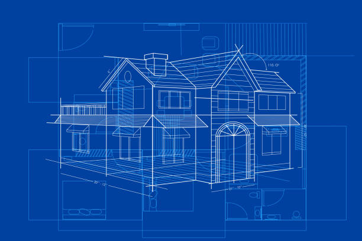

## Building a House

There are many ways to build a house, one may just stack mud with twigs and call it a house. There are many ways to build many different houses, but they all follow the same structured definition: a building with a foundation (could be the ground), walls, roof, and entrance(s). Design patterns are akin to a blueprint when constructing a house, as you can see the end result, a construction definition of a house, and what its features are, but the exact order of implementation, tools, and materials are up to the builder. Evidently, there are efficient ways to build a house, and inefficient ways as well. To elucidate, builders that are unfamiliar or naive when coming to constructing a house may create inefficient homes, such as a mud hut. This level of inefficiency is an example of an anti-pattern, which is a common response to a recurring problem that is ineffective and may be highly counterproductive.

## Forming the Connection

Bridging the gap, in software engineering, there exist many instances of similar problems that need to be solved. If the coder is unfamiliar with the common design patterns of the problem, then they could end up implementing their solution following an anti-pattern. Straying away from anti-patterns and implementing elegantly efficient code requires research into the problem and analyzing design patterns that follow that specific problem. Then the coder may implement the system by following these design patterns, which may result in a more efficient system. In my case, of the Unity obstacle course game I created, I could have implemented each obstacle as a separate entity and copied paste code for each entity, an anti-pattern, but I coded a general entity, a prefab, that I may mold into any other obstacle entity following an efficient design pattern.
