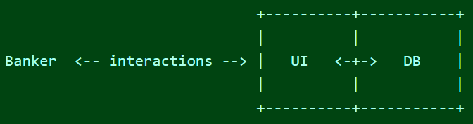
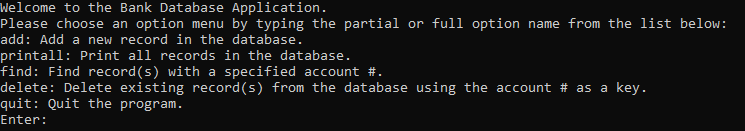

The goal of this project was to create a bank database application. I completed this project in the fall 2022 semester by myself for ICS 212. The database application contains a user interface and a database where the user interacts with the user interface and the actions they take modify the data in the database. The database stores information using a textfile, which allows the application to record entries and modify them even after the program has been restarted. The database application allows you to add records, print all records, find record(s), delete record(s), and quit the program. 

The application's [source code](https://github.com/beydlern/beydlern.github.io/tree/main/code/bankdatabaseapp) was coded in C++ and it has been thoroughly tested with a multitude of rigorous test cases to ensure stability and quality. However, outside of the academic environment, the user interface is rudimentary as it uses a general purpose language and the database is not secure.
