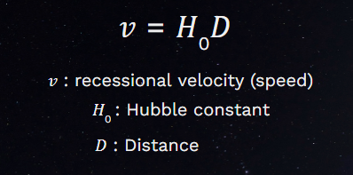

## Overview

The goal of this project was to analyze the Hubble Tension, a disagreement of the value of the Hubble constant, and investigate a method of obtaining the Hubble constant. I completed this project in the fall 2022 semester with professor [Dr. Rubin](https://www.phys.hawaii.edu/profile/David-Rubin/) and it was funded by [UROP](https://manoa.hawaii.edu/undergrad/urop/), however more work for the project is still underway. 

## Introduction

The Hubble constant, H_0, is a quantity that quantitatively describes the expansion rate of the universe. In the equation above called Hubble’s law, the Hubble constant is a constant of proportionality that relates the recessional velocities, v, (or speeds) of galaxies to their distances, D. So, the farther the selected object is, the faster they are moving away from us and the speed at which they move away from us is directly proportional to the distance they are from us by the Hubble constant. 

## Importance

The tension is between the “early” and “late” universe measurements, where the “early” universe measurements refers to the measurements of the Hubble constant using the cosmic microwave background method, and the “late” universe measurements refer to measurements of the Hubble constant obtained through methods of astronomical observation. To answer the question directly, the early and late universe measurements have arrived at high-precision values of the Hubble constant, so there must be something wrong like either side measuring something incorrectly or maybe we require a revision of our understanding of physics and the cosmic evolution of the universe, and this is the importance of the Hubble tension.

## Method

The Cepheid/SN distance ladder is a method of astronomical observation where each rung or step in the distance ladder leads to the next, like climbing a ladder we must climb each rung. A cepheid is a pulsating star that changes in brightness with a well-defined stable period and amplitude (basically it is a star that becomes bright and dim periodically and this cycle repeats predictably and this pattern lasts for a specific amount of time) and it turns out that their period (how often is pulsates) is directly related to its intrinsic brightness, and a supernova is a powerful and bright explosion of a star. Specifically, each rung refers to a specific class of observations, for example, in the Cepheid/SN distance ladder, the first rung is typically where we start with cepheids that are nearby enough to apply the geometric tool known as parallax to calculate the distance to the object. This method of parallax only works for close-by cepheids where parallax is defined as the shift in apparent location of a nearby object relative to other more distant objects as you change your observation point (parallax may be easily demonstrated by holding your thumb out in front of you and switching between your left and right eye). Then, after using these nearby cepheids and calculating the cepheid’s true brightness, we can proceed to the second rung of the distance ladder where we look at cepheids further in the galaxy where the parallax method breaks down, then with the calibrated true brightness of the cepheids determined in the first rung, we may compare it with the distant cepheid’s apparent brightness (brightness as seen from Earth) to determine accurate distances. With the cepheid’s calibrated, we look at other nearby galaxies that contain cepheid stars and Type Ia supernovae, where these galaxies are called host galaxies since they’re hosting the cepheids and type ia supernovae like in hosting a party, now the interesting fact about these type ia supernovae is that they explode and produce a fairly consistent peak true brightness, then we may use the cepheids to measure the true brightness of the supernovae in these host galaxies and ultimately determine the galaxies distances. In the third and final rung of this distance ladder, Type Ia supernovae are so bright that we may look at further galaxies where cepheids are too dim to be seen, then we may compare the true brightness of these supernovae as determined in the second rung with the apparent brightness of the supernovae found in these distant galaxies, and we compare these to measure the distance where the expansion of the universe can be seen. Then we can compare these distance measurements with how light from the supernovae that reaches us is Doppler shifted, specifically red-shifted, and the wavelength of the light is stretched to longer wavelengths by the expansion of space, then we may use these two values to calculate how fast the universe expands as time proceeds, which gives us the Hubble constant.

## Conclusion

The project uses Python to produce a value for the Hubble constant using the aforementioned method; it is still a work in progress as I plan to write a paper about the Hubble Tension and further expound upon the results of this research.
