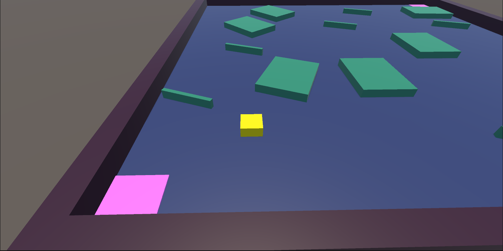
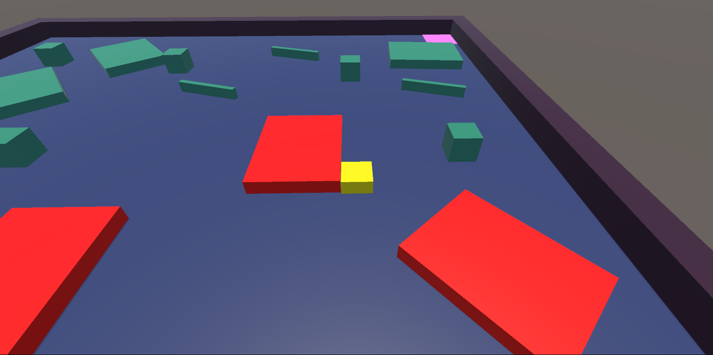

The goal of this project was to create an obstacle course game. I completed this project in the fall 2022 semester over a few weekends by myself for practice with Unity. The goal of the game is to move your player controlled block to the edge of the map (the pink square) and you start at a pink square at the other side of the map. 

In addition, the player block must try to avoid obstacles that fall out of the sky, spinning objects, and large static objects. However, if the player block collides with one of the other blocks, the other block transforms its color to red indicating that the player has bumped into it and an internal counter for how many collisions the player initatied is kept.

The game's [asset folder](https://github.com/beydlern/beydlern.github.io/tree/main/code/unity/Assets) for unity was coded in C# and the code has been tested a few times through the interactions with collisions and basic movement in the game. The simple obstacle game is rudimentary at its core, but it has provided me with a foundation to learn more with C# in Unity.
